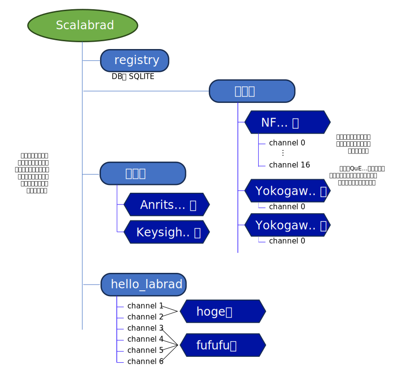

# もくじ
- Terminology
- labrad-test 環境構築
- Level1 Hello labrad
    * サービスの起動
    * クライアント
        - 接続情報
        - hello_labradサービス
- Level2 Hello labrad, 装置の仮想化
    * Level2 サービスの起動
    * チャネルの選択
    * チャネルの型による差異を吸収 - DeviceWrapper(s)
        - 異なる装置に対するインタフェースの実装

# Terminology
サーバという単語がたくさんでてくるので、scalabrad をサーバ、装置用のサーバをサービス、measurement_tools 側をクライアントと呼ぶことにする。
# labrad-test 環境構築

VM上のdebian12 (bookworm)で動作確認を行った。dockerイメージが大きくVMのディスク容量がギリギリ。
```
root# uname -a
Linux t-deb 6.1.0-17-amd64 #1 SMP PREEMPT_DYNAMIC Debian 6.1.69-1 (2023-12-30) x86_64 GNU/Linux
root# cat /etc/issue
Debian GNU/Linux 12 \n \l
```

dockerとdocker composeが動いていれば、次のコマンドで動くはず。
- SSL接続問題が docker の bridgeモードで解決しなかったため、docker-compose.yaml 内でnetwork_modeを hostにしている。scalabrad サーバのポートはホスト側にバインドすることにし、localhostで接続するとする。
- labrad/Dockerfile のベースイメージはPython3.10系のbookworm(debian12)を採用。3.11だとなぜか動かなかった。理由は失念
- 環境変数 `LABRADPASSWORD` を設定しておくと、サービス起動時に標準入力からパスワードを聞かれることがない。設定しないとパスワード入力待ちでサ ービスが止まる
```
root (or sudo) # docker compose up -d
```

javaがなにかソケットを開いてLISTEN状態だとよい。7643がSSL対応版、7682は旧Delphi版で使われていたSSL非対応版だったような。
```
root (or sudo)# ss -antp | grep java
LISTEN 0      4096                    *:7643                   *:*     users:(("java",pid=14197,fd=80))
LISTEN 0      4096                    *:7682                   *:*     users:(("java",pid=14197,fd=79))
```
# Level1 Hello labrad


## サービスの起動
適当なサービスを ./work/lv1Hello.py に作ってみた。./work ディレクトリ以下にバインドされているコンテナ内の /srv から lv1Hello.py を実行すると、簡単なサービスが起動する。このサービスは QubeServer.py などの装置に対応し、pylabrad を用いてサービスインスタンス化している。起動時に scalabrad に接続し、利用可能な RPC 等を登録する。
```
root (or sudo)# docker compose exec servers python lv1Hello.py
2024-03-03 06:45:11+0000 [-] Log opened.
2024-03-03 06:45:11+0000 [LabradProtocol,client] hello_labrad starting...
2024-03-03 06:45:11+0000 [LabradProtocol,client] hello_labrad now serving
```

## クライアント
クライアント(measurement_tool)側を起動する。適当にipython環境を立ち上げる。pylabradをインポートし、scalabradへ接続する。引数を省略すると LABRADHOST環境変数が優先される。環境変数が設定されていなくても localhost がデフォルトとなる。cxnが接続情報を格納するハンドルのようなもの(コンテキスト) である。どんなサービスが接続されているのか表示される。
- auth 認証用のサービスだが、あまり使い方を知らない
- registry : scalabrad 本体に組み込まれたレジストリ(設定データ保存)サービス。階層化されていて便利。サービスに必要なパラメータを外部から切り替え ることができる。
- manager: scalabrad 本体に組み込まれている管理ツール。scalabradへ接続されているサービスを強制的に切ったり、接続情報を取得したりできる。結構便利。
- hello_labrad: 今回作成したサーバ

```
root (or sudo)# docker compose exec servers ipython
In [1]: import labrad
In [2]: cxn=labrad.connect()
In [3]: cxn
Out[3]: LabRAD Client: 'Python Client (t-deb)' on localhost:7682
Available servers:
    auth
    hello_labrad
    manager
    registry
```

### 接続情報

サービスは接続ハンドル(cxn)のメンバオブジェクトになっていて、`__str__()`メソッドを呼び出すと登録されているRPC一覧が表示される。RPC一覧表示機能は再実装時に欲しいところ。
```
In [8]: print(cxn.manager.__str__())
LabRAD Server: Manager (ID=1)

Provides basic support for all labrad connections, including discovery of other servers and lookup of metadata about them.
Settings:
    close_connection
    connection_info
    connection_username
    convert
    data_to_pretty_string
    data_to_string
    echo
    expire_all
    expire_context
    help
    lookup
    lr_settings
    s__notify_on_context_expiration
    s__register_setting
    s__start_serving
    s__unregister_setting
    send_named_message
    servers
    string_to_data
    subscribe_to_named_message
    version
```

接続情報を提供する管理サービス(manager)の一機能だけ呼び出してみる。
```
In [9]: m=cxn.manager
In [10]: [x[:2] for x in m.connection_info()]
Out[10]: [(1, 'Manager'),
          (2, 'Registry'),
          (3, 'Auth'),
          (4, 'hello_labrad'),
          (1000000001, 'Python Client (t-deb)')]
```
 
### hello_labradサービス

今回は `Hello`というRPCを登録してみた。`Hello Labrad` という文字が返ってくる。RPCの一覧を確認すると (`h`の評価で`h.__str__()`の読み出しと同義)、自分が登録していないRPCも登録されている。labrad.devices.DeviceServer というクラスを継承使ったため。
```
In [29]: h=cxn.hello_labrad
In [30]: h.hello()
Out[30]: 'Hello Labrad 0/1'

In [31]: h.hello_without_threading()
Out[31]: 'Hello Labrad'

In [46]: h
Out[46]: LabRAD Server: hello_labrad (ID=4)
Settings:
    debug
    deselect_device
    echo
    hello
    hello_without_threading
    list_devices
    lock_device
    refresh_devices
    release_device
    select_device
    signal__log
 ```
 
 ### Hello RPCの二つの実装
 
 下記はサービスを実装する `work/lv1Hello.py` の抜粋。pylabrad (これはscalabradとは別)のサービス実装はPythonの仮想的なスレッディング実装である Twisted に強く依存している。Aさんのタスク1の処理待ち時間にBさんのタスク2の処理を実行できるためかなり便利。QubeServerなどは、より高度な 並列処理ライブラリ concurrent をTwistedに組み込む形で高速化している（というかしないと無駄が多すぎる）。下記の実装ではhello()実行ルーチンの一部をジェネレータ化し、その処理時間中に別のタスクを実行することができる。新しいRPCサービスでは並列化を阻害することのないフレームワークが望まれる。
 ```
 class helloLabrad(labrad.devices.DeviceServer):

  @labrad.server.setting( 100, 'Hello', returns = ['s'] )
  def service_hello(self,c):
    """
      This method returns Hello Labrad
    """
                                                            # *  Twisted allow to insert other task in the service
    ans0 = yield 0                                          # create generator here
                                                            # *  Twisted allow to insert other task in the service
    ans1 = yield 1                                          # create generator here
    twisted.internet.defer.returnValue( 'Hello Labrad {0}/{1}'.format( ans0, ans1 ))
```

もう一つの実装は、単純な手続き呼び出しである。この処理は一連の手続きが終了するまでプロセス内の他のタスクに処理を譲ることはない。
```
  @labrad.server.setting( 101, 'Hello_without_threading', returns = ['s'] )
  def service_hello_without_threading(self,c):
    """
      This method returns Hello Labrad
    """
    return 'Hello Labrad'
```

# Level2 Hello labrad, 装置の仮想化
システムを使い込んでいくと、下図のような状況に出会うでしょう。いろんな装置がScalabradに接続されますが、異なる会社のネットワークアナライザや、異なる会社の異なるチャネル数の電圧源などさまざまな装置がつながれることになります。QuE*社の装置は複数のタイプがあり、大した仕様の違いはないのですがタイプごとに区別されています。ユーザから見ると煩わしいこの仕様の違いや、LANやGPIB、SCPIなどの通信仕様の違いはうまく吸収し、画一的なインタフェースが上位レイヤに提供されるべきでしょう。


この例では装置を仮想化し、ユーザに対して均一的な素子インタフェースを提供する例を紹介します。

## Level2 サービスの起動

先述のLevel1 サービスを `Ctrl-C` を送信して停止します。下記のコマンドより `work/lv2Hello.py`にあるサービスを起動します。前よりたくさんのログがでています。複数のチャネルに対して素子の死活チェックをpingにより行い、接続を試みているように見えます。
```
root (or sudo)# docker compose exec servers python lv2Hello.py
2024-03-03 13:37:38+0000 [-] Log opened.
2024-03-03 13:37:38+0000 [LabradProtocol,client] hello_labrad starting...
2024-03-03 13:37:38+0000 [-] checking chanel chan0...
2024-03-03 13:37:38+0000 [-] pinging address 10
2024-03-03 13:37:38+0000 [-] checking chanel chan1...
2024-03-03 13:37:38+0000 [-] pinging address 11
2024-03-03 13:37:38+0000 [-] checking chanel chan2...
2024-03-03 13:37:38+0000 [-] pinging address 1
2024-03-03 13:37:38+0000 [-] checking chanel chan3...
2024-03-03 13:37:38+0000 [-] pinging address 4
2024-03-03 13:37:38+0000 [-] checking chanel chan4...
2024-03-03 13:37:38+0000 [-] pinging address 6
2024-03-03 13:37:38+0000 [-] checking chanel chan5...
2024-03-03 13:37:38+0000 [-] pinging address 2
2024-03-03 13:37:38+0000 [-] device hogehoge channel chan0 is connected.
2024-03-03 13:37:38+0000 [-] device hogehoge channel chan1 is connected.
2024-03-03 13:37:38+0000 [-] device fufufu channel chan2 is connected.
2024-03-03 13:37:38+0000 [-] device fufufu channel chan3 is connected.
2024-03-03 13:37:38+0000 [-] device fufufu channel chan4 is connected.
2024-03-03 13:37:38+0000 [-] device fufufu channel chan5 is connected.
2024-03-03 13:37:38+0000 [LabradProtocol,client] hello_labrad now serving
```

## チャネルの選択

Level 2 のサービスでは、異なる計測器メーカがチャンネルと呼ばれる何かを提供しているとしましょう。任意波形発生器かもしれませんし、電圧源かもしれません。とはいえチャンネルは電圧値を設定したり波形を設定する程度がユーザ側からの仕様ですので、メーカ別に異なる通信仕様などは隠ぺいしたくなるものです。ユーザ側から見えるインタフェースは「電圧を設定せよ」程度なはず。

下の例では複数の装置の複数のチャネルがひとまとめにhello_labradサービスに接続されている様子であり、各チャネルを選択して必要なメソッドを呼び出しています。

```
root (or sudo)# docker compose exec servers ipython
Python 3.10.13 (main, Feb 13 2024, 10:39:58) [GCC 12.2.0]
Type 'copyright', 'credits' or 'license' for more information
IPython 8.22.1 -- An enhanced Interactive Python. Type '?' for help.

In [1]: import labrad
In [2]: cxn=labrad.connect()
In [3]: h=cxn.hello_labrad

In [7]: h.list_devices()
Out[7]: [(0, 'chan0'),
         (1, 'chan1'),
         (2, 'chan2'),
         (3, 'chan3'),
         (4, 'chan4'),
         (5, 'chan5')]

In [8]: h.select_device('chan5')
Out[8]: 'chan5'

In [9]: h.hello(1)
Out[9]: 'Hello Labrad fufufu'

In [10]: h.select_device('chan0')
Out[10]: 'chan0'

In [11]: h.hello(1)
Out[11]: 'Hello Labrad hoge'
```

## チャネルの型による差異を吸収 - DeviceWrapper(s)

上の機能は Scalabrad ではなく、pylabrad の labrad.servers.devices ライブラリの機能です。フレームワークにこのような概念が取り込まれていると嬉しいです。デバイスをリスト表示、選択し、hello()メソッドを呼び出している様子です。chan5 を選択した場合には、fufufu という装置から返答が返ってきており、chan0 を選択した場合には、hogeという装置から返答が返るようになっています。

class HelloLabradの実装を紹介すると、DeviceWrapperというものが出てきます。これが各々の装置の差を吸収するためのクラスになっています。サービスを実装する DeviceServer の中でチャネルの定義が行われ、どのタイプの装置が、どのアドレスなのかという情報を記憶します。これらは通常 Scalabrad が提供するレジストリに書き込まれたものをロードします。

findDevice() というメソッドを上位クラスから継承・オーバーライドし、デバイスの接続情報を見ながら各装置の死活チェックを行います。生きているとチャネルを下位のAPIを使って開き、チャネルの型式によって正しくDeviceWrapperが選択され(chooseDeviceWrapper()を継承してオーバーライド)、チャネルとしてインスタンス化されます。

```
class hogehogeWrapper( labrad.devices.DeviceWrapper ):

  @twisted.internet.defer.inlineCallbacks
  def connect( self, *args, **kw ):
    pass

class fufufuWrapper( labrad.devices.DeviceWrapper ):

  @twisted.internet.defer.inlineCallbacks
  def connect( self, *args, **kw ):
    pass

class helloLabrad( labrad.devices.DeviceServer ):

  name           = 'hello_labrad' # Service name to be informed
  deviceWrappers = { 'hoge': hogehogeWrapper,
                     'fufu': fufufuWrapper }

  possibleLinks  = { 'chan0' : { 'type' : 'hoge', 'addr' : 10 },      # better to be load from the registry
                     'chan1' : { 'type' : 'hoge', 'addr' : 11 },
                     'chan2' : { 'type' : 'fufu', 'addr' :  1 },
                     'chan3' : { 'type' : 'fufu', 'addr' :  4 },
                     'chan4' : { 'type' : 'fufu', 'addr' :  6 },
                     'chan5' : { 'type' : 'fufu', 'addr' :  2 } }

  def chooseDeviceWrapper( self, *args, **kw ):

    ... snip ...

    return self.deviceWrappers[ tag ]

  @twisted.internet.defer.inlineCallbacks
  def findDevices( self ):

    found = list ()

    for channel_name in self.possibleLinks.keys():
      print( 'checking chanel {}...'.format( channel_name ))

      ... snip...
                                                            # open device handle with lower APIs
      # handle.initialize()                                 # you can do some initialization here
      ... snip...
      device       = ( channel_name, ( channel_name, device_type, handle ), { } )
      found.append( device )
    twisted.internet.defer.returnValue( found )
```

### 異なる装置に対するインタフェースの実装

Scalabrad サーバからのサービスに対するRPC呼び出しは、helloLabrad ( DeviceServer ) のメソッドを呼び出します。ここでは service_hello() を呼び出します。この中では、ユーザのコンテキスト `c` を用いて、ユーザの選択しているチャネルを得ます (selectedDevice(c))。このオブジェクトがdeviceWrapperのインスタンスであり、各チャネルを実装する装置ごとに必要な処理を実行します。chan0 が選択されていれば装置 hogehoge を、chan5 が選択されていれば装置 fufufu の処理コードを実行します。基本的に装置依存するSCPIコマンドや通信インタフェースはここで吸収されます。

```
class hogehogeWrapper( labrad.devices.DeviceWrapper ):

  @twisted.internet.defer.inlineCallbacks
  def hello_channel( self, repeat : int ):
    resp = yield 'hoge' * repeat
    twisted.internet.defer.returnValue( resp )

class fufufuWrapper( labrad.devices.DeviceWrapper ):

  @twisted.internet.defer.inlineCallbacks
  def hello_channel( self, repeat : int ):
    resp = yield 'fufufu' * repeat
    twisted.internet.defer.returnValue( resp )

class helloLabrad( labrad.devices.DeviceServer ):

  @labrad.server.setting( 201, 'Hello', repeat = [ 'w' ], returns = ['s'] )
  def service_hello( self, c, repeat ):
    """
    This method returns Hello Labrad
    """
    dev  = self.selectedDevice( c )
    resp = yield dev.hello_channel( repeat )
    twisted.internet.defer.returnValue( 'Hello Labrad {0}'.format( resp ))

```

