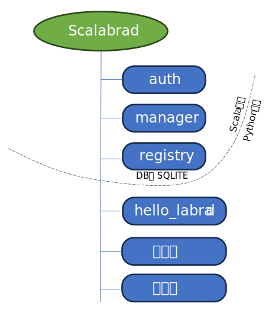

# Terminology
サーバという単語がたくさんでてくるので、scalabrad をサーバ、装置用のサーバをサービス、measurement_tools 側をクライアントと呼ぶことにする。
# labrad-test 環境構築

VM上のdebian12 (bookworm)で動作確認を行った。dockerイメージが大きくVMのディスク容量がギリギリ。
```
root# uname -a
Linux t-deb 6.1.0-17-amd64 #1 SMP PREEMPT_DYNAMIC Debian 6.1.69-1 (2023-12-30) x86_64 GNU/Linux
root# cat /etc/issue
Debian GNU/Linux 12 \n \l
```

dockerとdocker composeが動いていれば、次のコマンドで動くはず。
- SSL接続問題が docker の bridgeモードで解決しなかったため、docker-compose.yaml 内でnetwork_modeを hostにしている。scalabrad サーバのポートはホスト側にバインドすることにし、localhostで接続するとする。
- labrad/Dockerfile のベースイメージはPython3.10系のbookworm(debian12)を採用。3.11だとなぜか動かなかった。理由は失念
- 環境変数 `LABRADPASSWORD` を設定しておくと、サービス起動時に標準入力からパスワードを聞かれることがない。設定しないとパスワード入力待ちでサ ービスが止まる
```
root (or sudo) # docker compose up -d
```

javaがなにかソケットを開いてLISTEN状態だとよい。7643がSSL対応版、7682は旧Delphi版で使われていたSSL非対応版だったような。
```
root@t-deb:/home/tabuchi/work/labrad-test# ss -antp | grep java
LISTEN 0      4096                    *:7643                   *:*     users:(("java",pid=14197,fd=80))
LISTEN 0      4096                    *:7682                   *:*     users:(("java",pid=14197,fd=79))
```
# Level1 Hello labrad


## サービスの起動
適当なサービスを ./work/lv1Hello.py に作ってみた。./work ディレクトリ以下にバインドされているコンテナ内の /srv から lv1Hello.py を実行すると、簡単なサービスが起動する。このサービスは QubeServer.py などの装置に対応し、pylabrad を用いてサービスインスタンス化している。起動時に scalabrad に接続し、利用可能な RPC 等を登録する。
```
root (or sudo)# docker compose exec servers python lv1Hello.py
2024-03-03 06:45:11+0000 [-] Log opened.
2024-03-03 06:45:11+0000 [LabradProtocol,client] hello_labrad starting...
2024-03-03 06:45:11+0000 [LabradProtocol,client] hello_labrad now serving
```

## クライアント
クライアント(measurement_tool)側を起動する。適当にipython環境を立ち上げる。pylabradをインポートし、scalabradへ接続する。引数を省略すると LABRADHOST環境変数が優先される。環境変数が設定されていなくても localhost がデフォルトとなる。cxnが接続情報を格納するハンドルのようなもの(コンテキスト) である。どんなサービスが接続されているのか表示される。
- auth 認証用のサービスだが、あまり使い方を知らない
- registry : scalabrad 本体に組み込まれたレジストリ(設定データ保存)サービス。階層化されていて便利。サービスに必要なパラメータを外部から切り替え ることができる。
- manager: scalabrad 本体に組み込まれている管理ツール。scalabradへ接続されているサービスを強制的に切ったり、接続情報を取得したりできる。結構便利。
- hello_labrad: 今回作成したサーバ

```
root (or sudo)# docker compose exec servers ipython
In [1]: import labrad
In [2]: cxn=labrad.connect()
In [3]: cxn
Out[3]:
LabRAD Client: 'Python Client (t-deb)' on localhost:7682
Available servers:
    auth
    hello_labrad
    manager
    registry
```

### 接続情報

サービスは接続ハンドル(cxn)のメンバオブジェクトになっていて、`__str__()`メソッドを呼び出すと登録されているRPC一覧が表示される。RPC一覧表示機能は再実装時に欲しいところ。
```
In [8]: print(cxn.manager.__str__())
LabRAD Server: Manager (ID=1)

Provides basic support for all labrad connections, including discovery of other servers and lookup of metadata about them.
Settings:
    close_connection
    connection_info
    connection_username
    convert
    data_to_pretty_string
    data_to_string
    echo
    expire_all
    expire_context
    help
    lookup
    lr_settings
    s__notify_on_context_expiration
    s__register_setting
    s__start_serving
    s__unregister_setting
    send_named_message
    servers
    string_to_data
    subscribe_to_named_message
    version
 ```
 
 接続情報を提供する管理サービス(manager)の一機能だけ呼び出してみる。
 ```
In [9]: m=cxn.manager
In [10]: [x[:2] for x in m.connection_info()]
Out[10]:
[(1, 'Manager'),
 (2, 'Registry'),
 (3, 'Auth'),
 (4, 'hello_labrad'),
 (1000000001, 'Python Client (t-deb)')]
 ```
 
 ### hello_labradサービス
 
 今回は `Hello`というRPCを登録してみた。`Hello Labrad` という文字が返ってくる。RPCの一覧を確認すると (`h`の評価で`h.__str__()`の読み出しと同義)、自分が登録していないRPCも登録されている。labrad.devices.DeviceServer というクラスを継承使ったため。
 ```
In [29]: h=cxn.hello_labrad
In [30]: h.hello()
Out[30]: 'Hello Labrad 0/1'

In [31]: h.hello_without_threading()
Out[31]: 'Hello Labrad'

In [46]: h
Out[46]: LabRAD Server: hello_labrad (ID=4)
Settings:
    debug
    deselect_device
    echo
    hello
    hello_without_threading
    list_devices
    lock_device
    refresh_devices
    release_device
    select_device
    signal__log
 ```
 
 ### Hello RPCの二つの実装
 
 下記はサービスを実装する `work/lv1Hello.py` の抜粋。pylabrad (これはscalabradとは別)のサービス実装はPythonの仮想的なスレッディング実装である Twisted に強く依存している。Aさんのタスク1の処理待ち時間にBさんのタスク2の処理を実行できるためかなり便利。QubeServerなどは、より高度な 並列処理ライブラリ concurrent をTwistedに組み込む形で高速化している（というかしないと無駄が多すぎる）。下記の実装ではhello()実行ルーチンの一部をジェネレータ化し、その処理時間中に別のタスクを実行することができる。新しいRPCサービスでは並列化阻害することのないフレームワークが望まれる。
 ```
 class helloLabrad(labrad.devices.DeviceServer):

  @labrad.server.setting( 100, 'Hello', returns = ['s'] )
  def service_hello(self,c):
    """
      This method returns Hello Labrad
    """
                                                            # *  Twisted allow to insert other task in the service
    ans0 = yield 0                                          # create generator here
                                                            # *  Twisted allow to insert other task in the service
    ans1 = yield 1                                          # create generator here
    twisted.internet.defer.returnValue( 'Hello Labrad {0}/{1}'.format( ans0, ans1 ))
``` 
 
